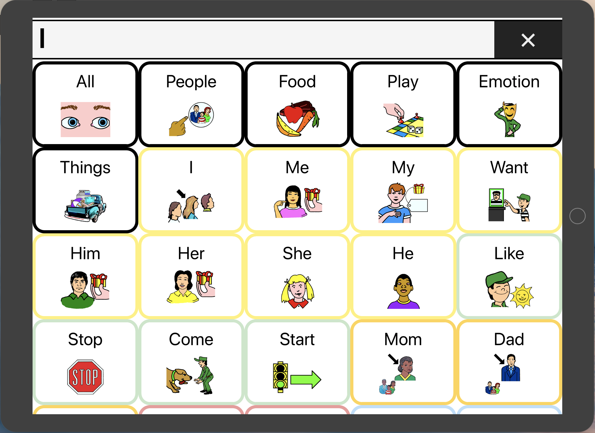
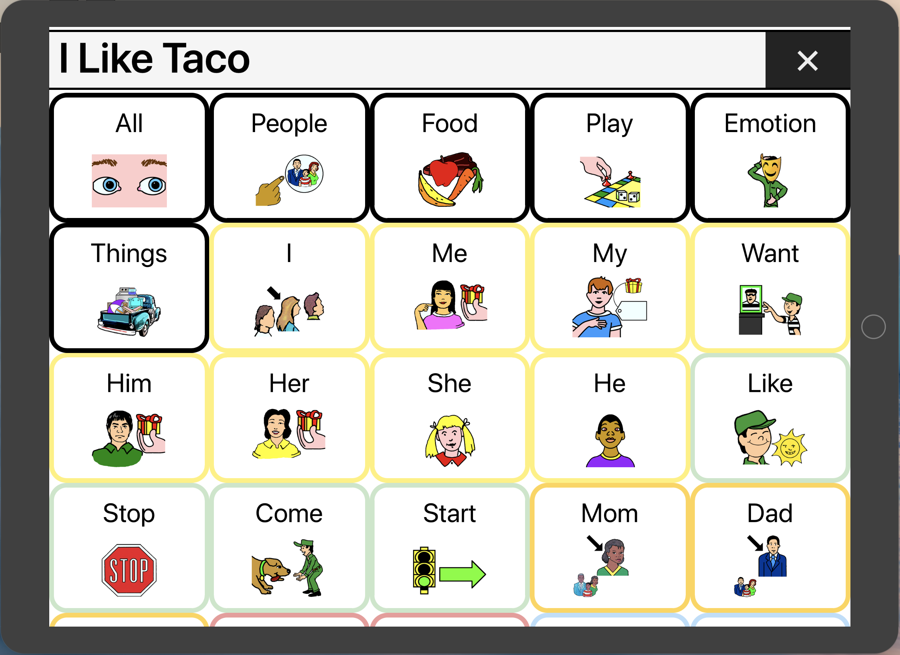
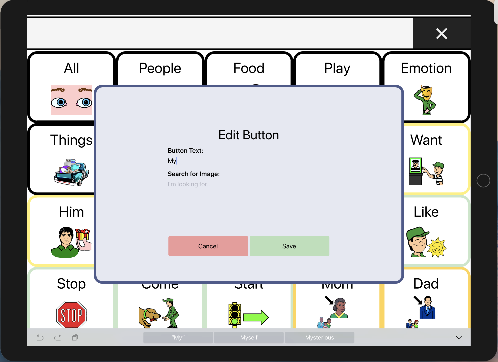
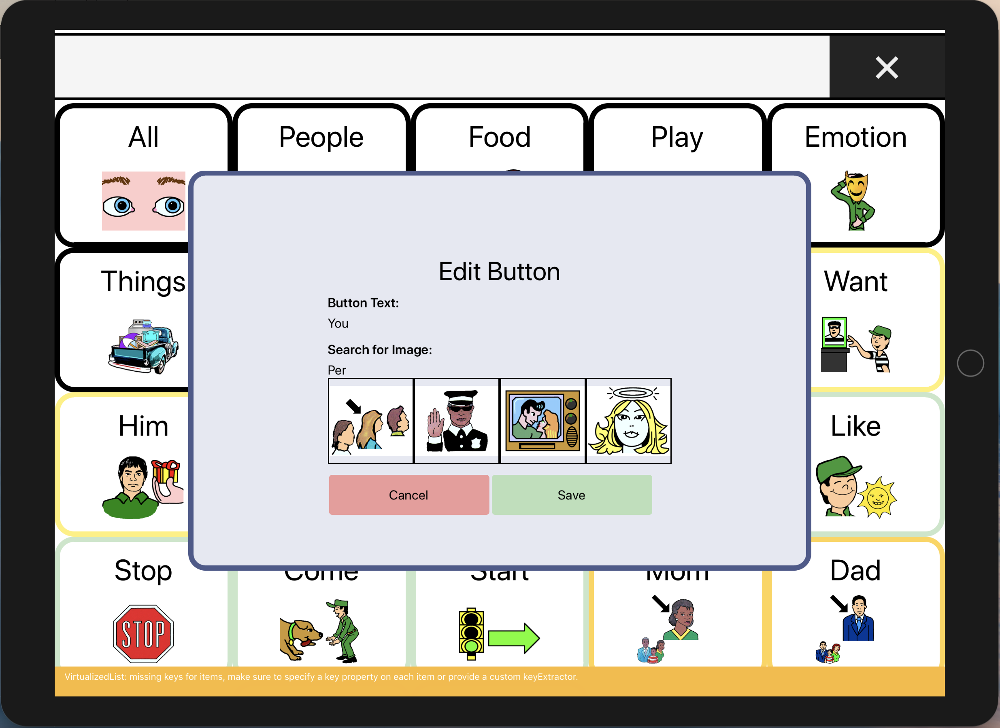
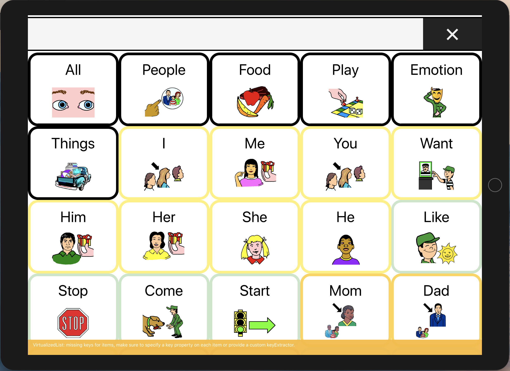

# Right to Speak

Imagine waking up without the ability to communicate. No voice, body language, gestures, or text. How would you hang out with your friends? Order food? Tell your family you love them?

Every day, there are over two million people in the United States who lack traditional means of communication due to congenital birth defects, cerebral palsy, autism, ALS, and other disabilities. 

With the assistance of technology, we can help those affected to communicate their choices, thoughts, and emotions. Unfortunately, cost is a large barrier to this technology. Speech-Language Pathologist, Daniel Rigney, aims to bridge this gap by creating a cross-platform app that is accessible to all.

## What is Right to Speak?

Right to Speak is our solution to this desparate need. This open-source Alternative and Augmentative Communication App is written in React Native for iOS and Android as part of the 2018 ATX Hack for Change Hackathon. 

## How to use Right to Speak:

Open the application on the device.

Tap a button to send text to the output bar.

Multiple button taps sends multiple text to the output bar.

Clear the output bar by tapping on the "X". Long press on a button to open edit mode.

Long press on the toggle on the bottom right to display the keyboard.

Tap desired letters. When finished, tap keyboard toggle on bottom right to hide keyboard.
Tap "Save" to save and close edit mode or tap "Cancel" to exit without saving.

The new word is displayed on the button.

## Technologies used:

* Expo
* React
* React Native
* React Native Responsive Grid
* React Native Speech

## Credits:

* [Angel Lo](https://github.com/thenameisangel)
* [Daniel Rigney](https://github.com/danielyrigney)
* [Isaac Lee](https://github.com/ijlee2)
* [Jessica Sung](https://github.com/JessicaSung)
* [Joshua Turgeon](https://github.com/jturgeon88)
* [Kristin Faner](https://github.com/seeksort)
* [Riss Gadi](https://github.com/pandafu)
* [Victor Rojas](https://github.com/Victorrent)
